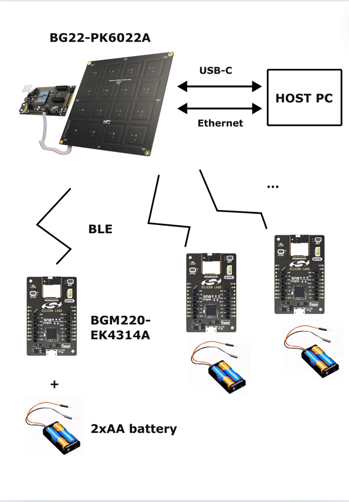
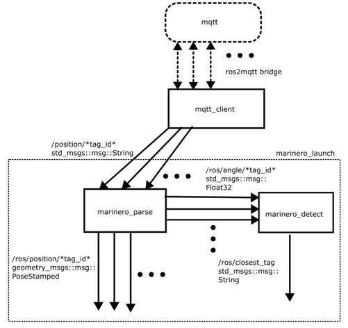

# Marinero identification and localization
Code in this repo implements a single-anchor solution for identification and localization of ships in a marina using Bluetooth Low Energy technology. Ships are identified and localized using AoA (Angle of Arrival) of the incoming signals from the transmitters placed on them. This code is intended to be used with the following hardware:
* BG22-PK6022A from *SiliconLabs*, as a BLE reciever: https://www.silabs.com/development-tools/wireless/bluetooth/bgm22-pro-kit?tab=overview
* BGM220-EK4314A from *SiliconLabs*, as a BLE transmitter: https://www.silabs.com/development-tools/wireless/bluetooth/bgm220-explorer-kit?tab=overview

The block diagram of this application is shown in the image below:

<p align="center">
  
</p>

## Repository components
### NCP_Host
This folder contains code intended to be run on Host PC. Marinero_bt_AoA_host is an application similar to bt_aoa_host_locator but with added marinero_distance.c and marinero_positioning.c. Marinero_distance.c contains function *calculate_avg_rssi* for RSSI filtering in real-time and function *marinero_calculate_distance* for distance calculation using RSSI.
### NCP_Target
This folder contains code intended to be flashed onto BG22-PK6022A. Code could be flashed by using either *SimplicityStudiov5* (https://www.silabs.com/developers/simplicity-studio) or by using a VSCode extension for flashing *SiliconLabs* boards (https://www.silabs.com/developers/simplicity-studio/visual-studio-code-plugin).
This code is the same as NCP_Target example in *SimplicityStudiov5*.
### SoC_Tag
This folder contains code intended to be flashed onto BGM220-EK4314A. Code could be flashed by using either *SimplicityStudiov5* (https://www.silabs.com/developers/simplicity-studio) or by using a VSCode extension for flashing *SiliconLabs* boards (https://www.silabs.com/developers/simplicity-studio/visual-studio-code-plugin).
This code is the same as SoC_Tag example in *SimplicityStudiov5*.
### marinero_ros2
This folder contains ros2 integration of said application. Package marinero_parse contains parsers for converting data into ros2 standard messages, marinero_launch contains a launchfile for the parsers, marinero_detect contains a node that identifies the nearest ship and marinero_msgs contains a custom AoA ros message. Mqtt_params package contains a .yaml files for configuring mqtt2ros2 bridge (https://github.com/ika-rwth-aachen/mqtt_client).

Ros2 package structure is shown in the diagram below:

<p align="center">
  
</p>

## Installation
Requirements:
* ROS2 Humble - https://docs.ros.org/en/humble/index.html
* eclipse mosquitto - https://mosquitto.org/
* SimplicityStudiov5 (for flashing) - https://www.silabs.com/developers/simplicity-studio
* mqtt_client (bridge between mqtt and ros2) - https://github.com/ika-rwth-aachen/mqtt_client

Optional:
* mqtt-explorer (viewing data being published to mosquitto) - http://mqtt-explorer.com/

## Usage
### Running NCP_Host
1. With BG22-PK6022A plugged into Host PC (via USB), build project from ```Marinero-Localization/NCP_Host/app/bluetooth/marinero_bt_AoA_host``` folder with ```make``` and then:
```sh
cd exe
./marinero_bt_AoA_host -u /dev/ttyACM0 -c ../config/marinero_locator_config.json
```
  
- '-u' parameter describes the port USB is plugged in  
- '-c' parameter is the path to locator configuration file

2. Running mqtt-explorer for preview, from command line:
```sh
mqtt-explorer
```
  
And then configure: 
- Host = ```localhost```  
- Port = ```1883```
### Running ROS2 commands
  3. First navigate to ```Marinero-Localization/marinero_ros2``` and then build and source the packages. Running mqtt_client (mqtt2ros2 bridge):
- if running in 'POSITION' mode  (see Configuration files section for details): 
```sh
ros2 launch mqtt_client standalone.launch.ros2.xml params_file:=Marinero-Localization/marinero_ros2/src/mqtt_params/mqtt_params_position.yaml
```
- if running in 'ANGLE' mode:  
```sh
ros2 launch mqtt_client standalone.launch.ros2.xml params_file:=Marinero-Localization/marinero_ros2/src/mqtt_params/mqtt_params_angle.yaml
```
4. Running marinero_parse, which parses positions into *PoseStamped* messages ('POSITION' mode) and angles into custom *Aoa* message, containing azimuth, elevation and distance data:
- if running in 'POSITION' mode:
```sh
ros2 launch marinero_launch parser_launch.py
``` 
- if running in 'ANGLE' mode:
```sh
ros2 launch marinero_launch parser_launch.py "mode:='angle'"
``` 
5. Running marinero_detect, which returns tag_id of the transmitter identified as the closest (ONLY RUN THIS IN 'POSITION' MODE):
```sh
ros2 run marinero_detect detect_closest
```
## Configuration files

## Resources
